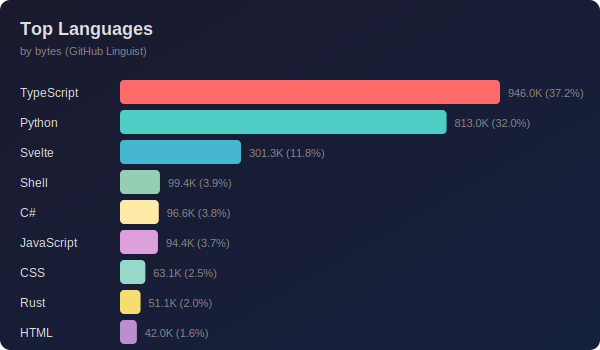
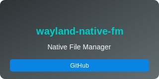
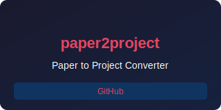
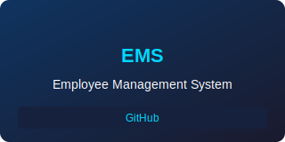

<!---
name: BandiAkarsh
👋 Hi, I'm Akarsh Bandi - Security Researcher & AI Developer
🔭 Currently working on AI-powered security tools
🌱 Learning more about LLM security and edge computing
💬 Ask me about Python, AI, Cybersecurity
📫 Reach me: akarshbandi82@gmail.com
âš¡ Fun fact: I build tools to detect phishing sites!
--->

  

---

## 📊 Language Stats

  

---

  

---

## � Achievements

  
  
  
  

---

  <picture>
    <source media="(prefers-color-scheme: dark)" srcset="dist/github-snake-dark.svg"/>
    <source media="(prefers-color-scheme: light)" srcset="dist/github-snake.svg"/>
    
  </picture>

---

  

---

## 💼 Featured Projects

  
  

  
  

---

## 🛠� Tech Stack

| Category | Technologies |
|----------|--------------|
| � **Security** | Python, TensorFlow, FastAPI, Docker |
| 🤖 **AI/ML** | PyTorch, MLflow, Jupyter, Scikit-learn |
| � **Web Dev** | TypeScript, Svelte, React, Node.js |
| �� **DevOps** | Docker, Kubernetes, CI/CD, Cloudflare |
| 📊 **Data** | Pandas, NumPy, SQL |

---

## 📫 Connect

  
  
  

---
<!---
📌 All cards are auto-generated via GitHub Actions
Card updates: Every 6 hours
Generated with �� by GitHub Actions
--=
